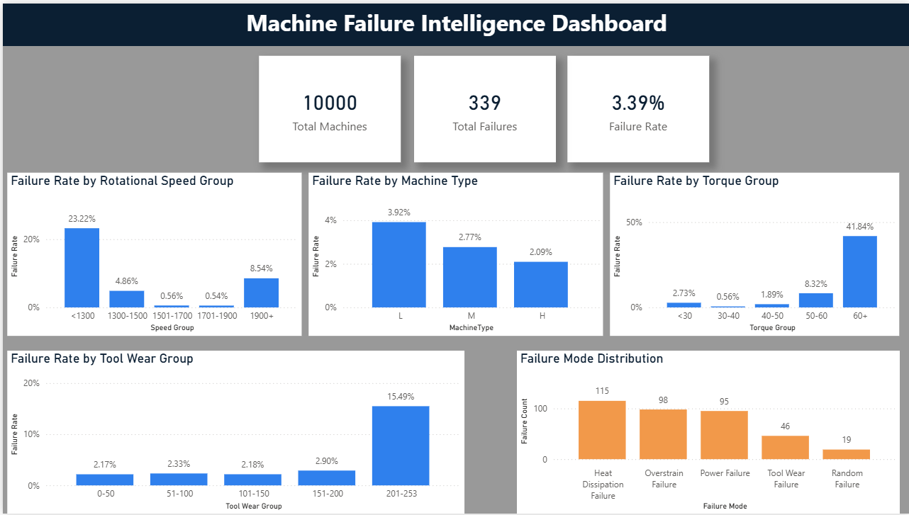
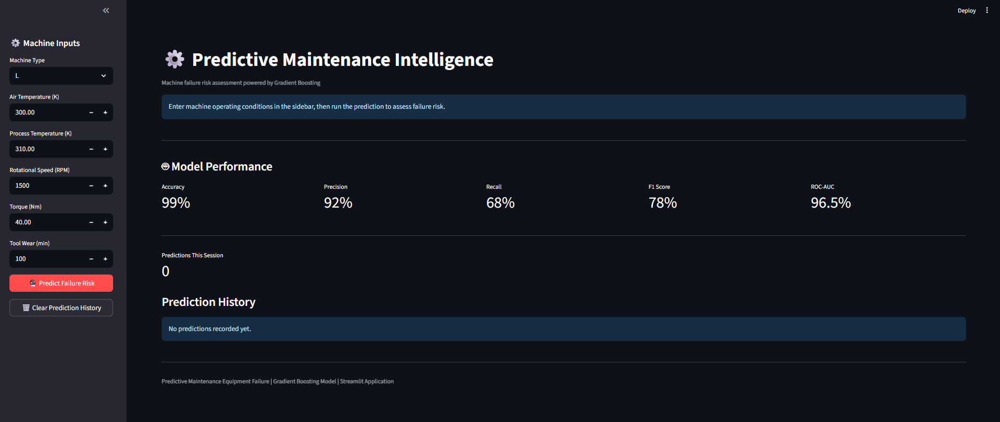
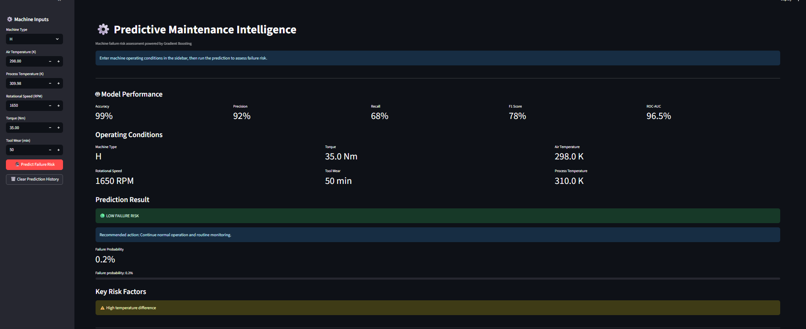
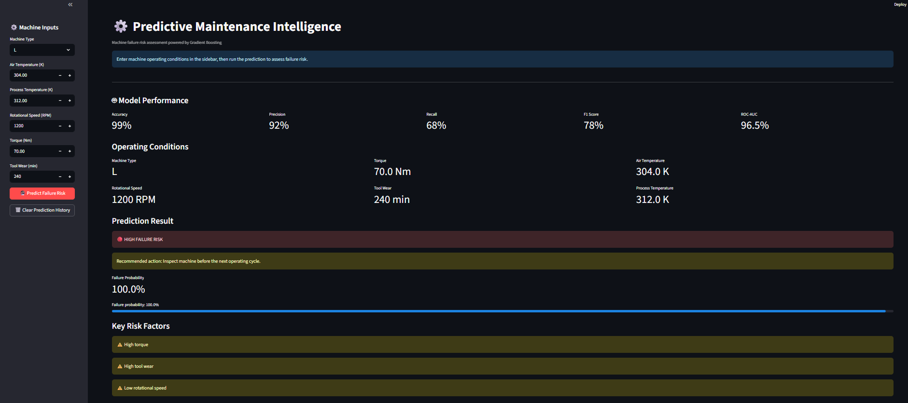
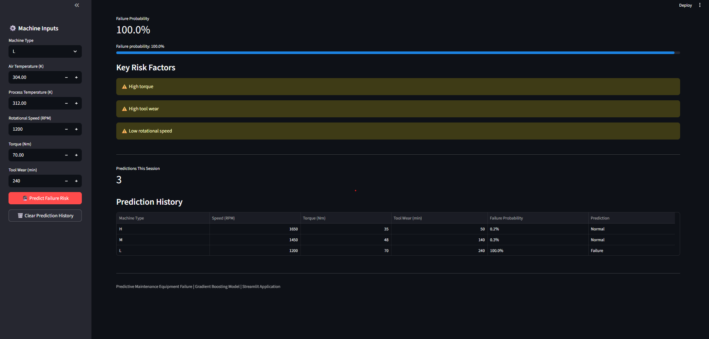

# ⚙️ Predictive Maintenance Equipment Failure


An end-to-end **Predictive Maintenance and Machine Failure Detection** project that uses **Machine Learning, SQL, Power BI, and Streamlit** to analyze industrial equipment data, identify failure patterns, estimate machine failure probability, and support maintenance decision-making.

The project combines exploratory data analysis, machine learning, business intelligence, and an interactive prediction application into a complete predictive-maintenance workflow.

---


# 🚀 Live Demo

🌐 **Try the application here**

[**Open Predictive Maintenance App**](https://predictive-maintenance-equipment-failure.onrender.com)

---

# 🚀 Project Demo

### 🖥️ Interactive Streamlit Application

The Streamlit application allows users to enter machine operating conditions and receive an instant failure-risk prediction.

```text
Machine Operating Conditions
          │
          ▼
   Machine Failure Model
          │
          ▼
 Failure Probability
          │
          ▼
 Risk Classification
          │
          ▼
 Maintenance Recommendation
```

---

# 📌 Overview

Unexpected industrial equipment failures can lead to production downtime, maintenance costs, and operational disruption.

This project aims to predict the likelihood of machine failure based on operating conditions such as:

- Machine Type
- Air Temperature
- Process Temperature
- Rotational Speed
- Torque
- Tool Wear

The project follows an end-to-end data analytics and machine-learning workflow:

```text
Raw Machine Data
       │
       ▼
Data Cleaning & Exploration
       │
       ▼
Feature Analysis
       │
       ▼
Machine Learning
       │
       ▼
Gradient Boosting Model
       │
 ┌─────┼──────────────┐
 ▼     ▼              ▼
SQL   Power BI     Streamlit
Analysis Dashboard Application
                       │
                       ▼
                Failure Prediction
```

---

# ⭐ Project Highlights

- 🤖 Machine Failure Prediction using Gradient Boosting
- 📊 Exploratory Data Analysis
- 🔍 Failure Pattern Analysis
- 🗄️ SQL-based Data Analysis
- 📈 Power BI Interactive Dashboard
- 🖥️ Streamlit Prediction Application
- ⚠️ Failure Risk Classification
- 📉 Failure Probability Estimation
- 🔎 Risk Factor Identification
- 📋 Prediction History
- 🤖 Model Performance Dashboard
- 💾 Saved Machine Learning Pipeline
- 🔧 Maintenance Recommendations
- 🧪 Multiple Prediction Scenarios

---

# 📸 Project Preview

## Power BI Dashboard



---

## Streamlit Dashboard



---

## Low-Risk Prediction



---

## High-Risk Prediction



---

## Prediction History



---

# ✨ Features

### 📊 Exploratory Data Analysis

The project investigates machine operating conditions and their relationship with equipment failure.

Analysis includes:

- Failure distribution
- Machine type analysis
- Torque analysis
- Rotational speed analysis
- Tool wear analysis
- Temperature relationships
- Failure-mode analysis

---

### 🤖 Machine Learning

A **Gradient Boosting Classifier** is used to predict whether a machine is likely to fail.

The final model is implemented inside a scikit-learn pipeline containing the required preprocessing and classification steps.

---

### 📈 Failure Probability

Instead of providing only a binary prediction, the Streamlit application displays the estimated probability of machine failure.

Example:

```text
Failure Probability
       99.7%
```

This allows the result to be interpreted as a risk score rather than simply a Yes/No prediction.

---

### ⚠️ Risk Classification

The application converts the predicted probability into three operational risk categories:

| Failure Probability | Risk Level | Recommended Action |
|---|---|---|
| `< 30%` | 🟢 Low | Continue normal operation |
| `30% – 69.9%` | 🟡 Medium | Monitor and schedule inspection |
| `≥ 70%` | 🔴 High | Inspect machine before next operating cycle |

---

### 🔍 Risk Factor Analysis

The application highlights operating conditions that may contribute to increased risk.

Examples include:

- ⚠️ High Torque
- ⚠️ High Tool Wear
- ⚠️ Low Rotational Speed
- ⚠️ High Temperature Difference

These indicators provide an easier operational interpretation of the prediction.

---

### 📋 Prediction History

The Streamlit application records predictions during the current session.

The history contains:

- Machine Type
- Rotational Speed
- Torque
- Tool Wear
- Failure Probability
- Prediction Result

Users can also clear the prediction history.

---

# 🧠 Machine Learning Workflow

```text
Machine Dataset
      │
      ▼
Data Cleaning
      │
      ▼
Exploratory Data Analysis
      │
      ▼
Feature Preparation
      │
      ▼
Train / Test Split
      │
      ▼
Preprocessing Pipeline
      │
      ▼
Gradient Boosting Classifier
      │
      ▼
Model Evaluation
      │
      ▼
Joblib Model Serialization
      │
      ▼
Streamlit Prediction App
```

---

# 🏆 Machine Learning Model

The final model is a **Gradient Boosting Classifier**.

### Model Configuration

```python
GradientBoostingClassifier(
    n_estimators=200,
    learning_rate=0.05,
    max_depth=3,
    random_state=42
)
```

The complete trained pipeline is saved using Joblib:

```text
app/model/gradient_boosting_pipeline.joblib
```

This allows the Streamlit application to load the same preprocessing and model pipeline used during training.

---

# 📊 Model Performance

The final Gradient Boosting model achieved the following results on the test set:

| Metric | Score |
|---|---:|
| Accuracy | 99% |
| Precision | 92% |
| Recall | 68% |
| F1 Score | 78% |
| ROC-AUC | 96.5% |

### Classification Performance

```text
              Precision    Recall    F1-Score

Class 0          0.99       1.00       0.99
Class 1          0.92       0.68       0.78

Accuracy                              0.99
```

### Important Observation

Although the model achieves approximately **99% overall accuracy**, the recall for the failure class is approximately **68%**.

This is important in a predictive-maintenance context because correctly identifying actual failures is more important than relying only on overall accuracy.

The ROC-AUC score of **96.5%** indicates strong discrimination between normal and failure cases.

---

# 🗄️ SQL Analysis

SQL was used to perform structured analysis of the machine data and answer business-oriented questions.

The SQL workflow includes:

- Database/table creation
- Data loading
- Data validation
- Failure analysis
- Aggregations
- Business-focused queries

SQL files are available in:

```text
sql/
```

---

# 📊 Power BI Dashboard

The Power BI dashboard provides an interactive analytical view of machine failures.

The dashboard focuses on:

- Failure counts
- Failure modes
- Machine operating conditions
- Torque groups
- Failure patterns
- Operational trends

The dashboard complements the machine-learning model by providing **historical and descriptive analytics**, while the Streamlit application provides **individual machine-level predictions**.

---

# 🖥️ Streamlit Application

The Streamlit application provides an interactive interface for machine failure prediction.

Users can enter:

```text
Machine Type
Air Temperature
Process Temperature
Rotational Speed
Torque
Tool Wear
```

The application then provides:

```text
Prediction
Failure Probability
Risk Level
Recommended Action
Risk Factors
Prediction History
```

---

# 🧪 Example Predictions

## 🟢 Low-Risk Example

```text
Machine Type: H
Air Temperature: 298 K
Process Temperature: 308 K
Rotational Speed: 1650 RPM
Torque: 35 Nm
Tool Wear: 50 min
```

Observed prediction:

```text
🟢 LOW FAILURE RISK

Failure Probability: 0.2%
```

---

## 🔴 High-Risk Example

```text
Machine Type: L
Air Temperature: 302 K
Process Temperature: 310 K
Rotational Speed: 1300 RPM
Torque: 65 Nm
Tool Wear: 200 min
```

Observed prediction:

```text
🔴 HIGH FAILURE RISK

Failure Probability: 99.7%
```

Identified risk factors:

```text
⚠️ High torque
⚠️ High tool wear
⚠️ Low rotational speed
```

---

# 🛠️ Tech Stack

| Category | Technology |
|---|---|
| 🐍 Programming Language | Python |
| 📊 Data Processing | Pandas, NumPy |
| 📓 Development | Jupyter Notebook |
| 🤖 Machine Learning | Scikit-learn |
| 🌲 Final Model | Gradient Boosting |
| 💾 Model Serialization | Joblib |
| 🗄️ Database Analysis | SQL |
| 📈 Business Intelligence | Power BI |
| 🖥️ Web Application | Streamlit |
| 🔧 Version Control | Git |
| ☁️ Repository | GitHub |

---

# 📂 Project Structure

```text
Predictive-Maintenance-Equipment-Failure/
│
├── app/
│   ├── app.py
│   └── model/
│       └── gradient_boosting_pipeline.joblib
│
├── data/
│   └── raw/
│
├── images/
│   ├── powerbi_machine_failure_dashboard.png
│   ├── streamlit_dashboard_overview.png
│   ├── streamlit_high_risk_prediction.png
│   ├── streamlit_low_risk_prediction.png
│   └── streamlit_prediction_history.png
│
├── notebooks/
│   └── 01_Exploratory_Data_Analysis.ipynb
│
├── powerbi/
│   └── Machine_Failure_Intelligence_Dashboard.pbix
│
├── sql/
│   ├── 01_database_schema.sql
│   ├── 02_data_loading.sql
│   ├── 03_data_validation.sql
│   └── 04_business_analysis.sql
│
├── .gitignore
├── LICENSE
├── README.md
└── requirements.txt
```

---

# 🚀 Installation

## 1. Clone the Repository

```bash
git clone https://github.com/harsh8767/predictive-maintenance-equipment-failure.git
```

## 2. Navigate into the Project

```bash
cd predictive-maintenance-equipment-failure
```

---

## 3. Create a Virtual Environment

### Windows

```bash
python -m venv venv
venv\Scripts\activate
```

### Linux / macOS

```bash
python3 -m venv venv
source venv/bin/activate
```

---

## 4. Install Dependencies

```bash
pip install -r requirements.txt
```

---

# ▶️ Run the Streamlit Application

From the project root:

```bash
streamlit run app/app.py
```

The application will open in your browser.

---

# 📌 How to Use the Application

### Step 1

Open the Streamlit application.

### Step 2

Enter machine operating conditions using the sidebar.

### Step 3

Click:

```text
🔮 Predict Failure Risk
```

### Step 4

Review:

- Failure probability
- Risk classification
- Recommended action
- Key risk factors

### Step 5

Review previous predictions in the Prediction History section.

---

# 💡 Key Insights

The project demonstrates several important predictive-maintenance concepts:

- Machine failure is influenced by multiple operating conditions rather than a single variable.
- Torque and tool wear can be important indicators of increased failure risk.
- Lower rotational speed combined with higher torque can represent a higher-risk operating condition.
- Machine-learning probabilities can be translated into operational risk categories.
- Historical analytics and predictive analytics provide complementary views of equipment health.

---

# ⚠️ Limitations

- The model is trained on historical machine data and may not generalize perfectly to different industrial environments.
- The failure-class recall is lower than the overall accuracy.
- Risk thresholds used by the Streamlit application are application-level decision rules.
- The rule-based risk-factor explanations are intended for interpretability and do not represent the model's exact internal decision process.
- Real-time sensor integration is not currently implemented.

---

# 🚀 Future Improvements

Potential future enhancements include:

- SHAP-based model explanations
- Real-time IoT sensor integration
- Automated model retraining
- Model monitoring and drift detection
- Time-series failure prediction
- Maintenance-cost optimization
- Real-time alerts
- Cloud deployment
- Automated maintenance scheduling
- Integration with industrial monitoring systems

---

# 🙏 Acknowledgements

This project makes use of the following open-source technologies:

- Python
- Pandas
- NumPy
- Scikit-learn
- Joblib
- Streamlit
- Power BI
- SQL
- Jupyter
- Git

---

# 👨‍💻 Developer

## Harsh Chavan

Computer Engineering Student

Passionate about **Artificial Intelligence, Machine Learning, Data Analytics, SQL, Power BI, and Python Development**.

### GitHub

https://github.com/harsh8767

### LinkedIn

https://www.linkedin.com/in/harsh-chavan-1646a2257/

---

# 📜 License

This project is licensed under the MIT License.

See the `LICENSE` file for more information.
